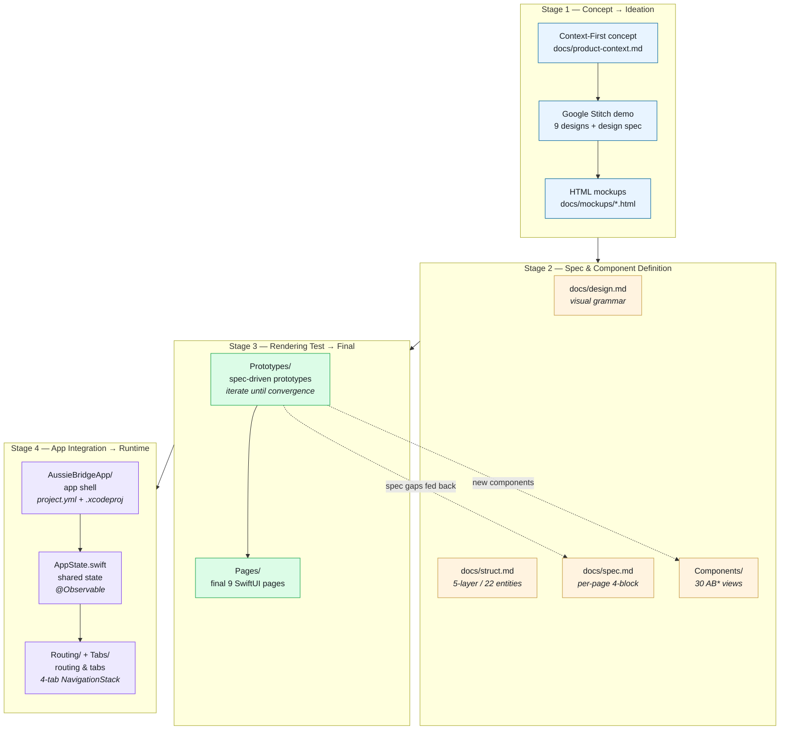

<p align="center">
  
</p>

# AussieBridge

> The app, repository, and Swift namespace are all **AussieBridge**. The team also presents the product publicly under the brand name **Linkaroo**.

A platform for newly-arrived migrants in Sydney, combining **community Q&A** (categorized, credibility-tagged) with **1-on-1 volunteer matching**. The personal variation explored in this repo is **Context-First** — the app treats user identity, location, and urgency as a *filter* rather than a *feature*, so the same content surfaces differently depending on who is reading.

<p align="center">
  
</p>

<p align="center">
  
</p>

📱 **[See every screen state →](SCREENSHOTS.md)**

## Status

iOS prototype with **9 spec-driven core pages**, built as a SwiftUI design system (single Swift Package) plus a runnable App Target that assembles the pages into a 4-tab application. Every page lives behind `#Preview` in Xcode Canvas (open `ABDesignSystem/Package.swift`) and behind a tab in the runnable app (open `AussieBridgeApp/AussieBridge.xcodeproj`).

## Repository layout

Top-level:

| Path              | What's inside                                                              |
| ----------------- | -------------------------------------------------------------------------- |
| `ABDesignSystem/` | Swift Package — the iOS prototype itself (tokens · components · models · pages) |
| `docs/`           | Written specs + Stitch HTML mockups (the project's readable spec set)      |

`ABDesignSystem/Sources/` (4-layer architecture):

```
Sources/
├── ABColors.swift · ABTypography.swift · ABSpacing.swift · ABElevation.swift   ← layer 1: design tokens
├── Components/                                                                  ← layer 2: 30 reusable SwiftUI components
├── Models/                                                                      ← layer 3: ABModels + ABMockData
├── Pages/                                                                       ← layer 4: 9 self-contained pages
│   ├── OnboardingView      — identity capture (language / status / location / arrival)
│   ├── HomeView            — search + service grid + featured guide + recommendations
│   ├── CommunityView       — people you can help carousel + questions you can answer list
│   ├── QAListView          — Reddit-style Q&A list with category filter
│   ├── QADetailView        — single thread + Top Answer + match-volunteer CTA
│   ├── VolunteerMatchView  — best-fit hero + "why she's a match" + more matches
│   ├── MessageListView     — All / Unread segmented inbox
│   ├── ChatView            — shared-context handoff + action pills + bubbles
│   └── ProfileView         — identity read-back; "Edit profile" re-enters Onboarding
└── Screens/                                                                     ← layout scaffold helpers
```

`docs/`:

```
docs/
├── product-context.md  Context-First mechanism summary (5 contextual moments)
├── design.md           Authoritative design spec (tokens · type · elevation · components)
├── struct.md           Data model — 22 entities organised into 5 Context-First layers
├── struct.html         Rendered HTML version of struct.md (open in browser)
├── spec.md             Page-level functional spec — 4-block template per page (§1–§9)
└── mockups/            Stitch-generated HTML mockups — visual prior to the SwiftUI implementation
    ├── personalization.html · homepage.html · community.html · volunteer.html
    ├── qa.html · qa_scroll.html      (two variants — SwiftUI's QAListView consolidates both)
    ├── message.html · chat.html · profile.html
```

`AussieBridgeApp/` (App Target — wires the 9 pages into a runnable app):

```
AussieBridgeApp/
├── AussieBridgeApp.swift   ← @main entry; injects AppState into the SwiftUI environment
├── AppState.swift          ← @Observable single source of truth (current ABUser, navigation paths)
├── Routing/                ← Route enum + RootView + MainTabView + OnboardingFlowView
├── Tabs/                   ← 4 Tab wrappers (Home / Community / Messages / Profile), each a NavigationStack
└── project.yml             ← XcodeGen-managed declarative project file
```

## Pages

The product is **9 core pages**. Each page has a spec section, an HTML mockup, and a SwiftUI file — three artefacts that must stay in sync.

| § | Page | SwiftUI file | Mockup | One-line role |
|---|---|---|---|---|
| §1 | Onboarding | `Pages/OnboardingView.swift` | `mockups/personalization.html` | Identity capture (language · status · location · duration) — and the same form re-used for §9 Edit |
| §2 | Home | `Pages/HomeView.swift` | `mockups/homepage.html` | Profile-driven push hub — search + 10 services + featured guide + recommendations |
| §3 | Community | `Pages/CommunityView.swift` | `mockups/community.html` | Single hub: people-you-can-help carousel + questions-you-can-answer list |
| §4 | Q&A List | `Pages/QAListView.swift` | `mockups/qa.html` (+ `qa_scroll.html`) | Category-filtered list of `ABQAPost` with credibility tags inline |
| §5 | Q&A Detail | `Pages/QADetailView.swift` | `mockups/qa.html` | Single thread + Top Answer + "Match a volunteer" CTA into §6 |
| §6 | Volunteer Match | `Pages/VolunteerMatchView.swift` | `mockups/volunteer.html` | Top-choice hero + visible match-reasons (mechanism 4 made legible) |
| §7 | Message List | `Pages/MessageListView.swift` | `mockups/message.html` | All / Unread segmented inbox of conversations |
| §8 | Chat | `Pages/ChatView.swift` | `mockups/chat.html` | 1-on-1 chat with originating Q&A mounted as shared-context card |
| §9 | Profile | `Pages/ProfileView.swift` | `mockups/profile.html` | Identity read-back of the captured ABUser; "Edit profile" re-enters §1 |

In the runnable app, the 9 pages are arranged behind a 4-tab bottom bar:
**Home (§2)** · **Community (§3 → §4 → §5 → §6 → §8)** · **Messages (§7 → §8)** · **Profile (§9 → §1 in edit mode)**.

## Quick start

There are two ways to run this prototype, depending on what you want to see.

### A. Single-page Canvas preview (design-system view)

1. Open `ABDesignSystem/Package.swift` in Xcode.
2. In the project navigator, click any file under `Sources/Pages/` or `Sources/Components/`.
3. Press `⌥⌘↵` to reveal the Canvas; choose an **iPhone 16 Pro** simulator as the preview target.
4. Click the live-preview ▶ button on the Canvas toolbar — interactions (scroll, tap, type) work in this mode.

To verify the package builds:
```sh
cd ABDesignSystem
swift build
```

### B. Full iOS App in the simulator (functional view)

The App Target is generated declaratively from `AussieBridgeApp/project.yml` via [XcodeGen](https://github.com/yonaskolb/XcodeGen). The committed `.xcodeproj` will work as-is, but if you want to regenerate it locally:

```sh
brew install xcodegen           # if not already installed
cd AussieBridgeApp
xcodegen generate
```

Then:

1. Open `AussieBridgeApp/AussieBridge.xcodeproj` in Xcode.
2. Select an **iPhone 16 Pro** simulator from the run-destination menu.
3. Press ▶ (or `⌘R`) to build and run.

The launch flow is: Onboarding → Home → tap any service tile → Q&A list → tap a post → Q&A Detail → "Match a volunteer" → Volunteer Match (originating post surfaces as a subtitle) → "Start chat" → auto-hops to Messages tab → Chat (with shared-context card). Tap the shared-context card to round-trip back to the originating Q&A. The Profile tab shows the user record captured during onboarding; "Edit profile" re-enters the same Onboarding form with the current values prefilled — saving updates the global ABUser and re-ranks every downstream feed.

## Design rationale

The product is built on one user-research insight, captured verbatim during a Checkpoint 1 interview:

> *"Language is a meta-barrier."*

This sentence drives every downstream decision: typography line-height, tag credibility hierarchy, visible match-reasons, context-aware chat handoff. Each of the 5 Context-First mechanisms exists because language gates information access — and gating must therefore be made visible, not algorithmic.

See `docs/product-context.md` for the full mechanism summary.

## AI workflow

This repo is built with a **spec-driven** workflow in 4 stages. AI (Claude Code) is bounded to *executing each step against the artefact upstream of it* — no free-form generation. Components are not a separate stage; they are a *mindset* carried through every stage (every visual / page region resolves to a reusable `AB*` component, never a one-off).

| Stage | Sub-step | Key artefact |
| ----- | -------- | ------------ |
| **1. Concept → Ideation** *(form a shared "what are we building")* | (1) Context-First defined as the personal variation: identity / location / urgency act as a *filter* over the same content. | `docs/product-context.md` (5 mechanisms) |
| | (2) Google Stitch generated the 9 page designs + an auto-generated design specification, copied verbatim into the repo. | Stitch design output, hand-pasted into `docs/design.md` |
| | (3) The 9 Stitch screenshots were converted into static HTML — kept as a fidelity reference for downstream SwiftUI implementations. | `docs/mockups/*.html` (9 pages) |
| **2. Spec & Component Definition** *(produce the static contract: visual / data / behaviour / building blocks)* | (a) Calibrate the Stitch-pasted design spec — tokens, typography scale, elevation, component visual grammar. | `docs/design.md` |
| | (b) Personalised data model — the team's group structure refined into 5 Context-First layers (22 entities). Not derived from Stitch; captures how the mechanisms compose at the data level. | `docs/struct.md` + `docs/struct.html` |
| | (c) Per-page functional spec — 4-block template (Overview / Parameters / Actions / Layout) at wireframe precision, written in conversation with Claude. | `docs/spec.md` (`§1`–`§9`) |
| | (d) Initial component library — 30 reusable `AB*` views derived from the visual grammar so spec.md regions resolve to real Swift types, not free-form decisions. | `ABDesignSystem/Sources/Components/` |
| **3. Rendering Test → Final** *(use code to reverse-validate the spec; close gaps, then graduate)* | Each page is re-implemented from `spec.md` *without reading the existing `Pages/` source*. Gaps surface as "had to self-pick a token / copy / behaviour" notes; spec.md and the component library are amended; the prototype iterates until it converges. Once converged, it graduates to `Pages/*View.swift`. | `ABDesignSystem/Sources/Prototypes/` (evolution record) → `ABDesignSystem/Sources/Pages/` (final 9 views) |
| **4. App Integration → Runtime** *(stages 1–3 produce 9 independently previewable pages; stage 4 wires them into a single runnable iOS app — adding the app shell, the shared state that lets pages talk to each other, and the routing that connects them)* | (a) **App shell** — an iOS app target generated declaratively by XcodeGen, depending on `ABDesignSystem` as a local Swift Package. | `AussieBridgeApp/project.yml` + `AussieBridge.xcodeproj` |
| | (b) **Shared state** — an `@Observable` AppState is the app's single "memory": the captured ABUser and each tab's navigation history live here, and all 9 pages read/write the same instance through the SwiftUI environment. | `AussieBridgeApp/AppState.swift` |
| | (c) **Routing & tabs** — a typed `Route` enum lists every "from-here-to-there" as a case; 4 Tab wrappers (Home / Community / Messages / Profile) each own a NavigationStack. The §5 → §6 → §8 cross-tab handoff and the §1 ↔ §9 Edit profile loop both flow through this layer. | `AussieBridgeApp/Routing/Route.swift` + `AussieBridgeApp/Tabs/*Tab.swift` |



The two dashed feedback edges from Stage 3 back to Stage 2 are what makes this workflow *spec-driven* rather than just spec-aligned: the prototypes don't merely consume the spec — they pressure-test it, and any gap they expose is closed in the spec or the component library before the page graduates. Stage 4 then assembles the converged pages into a runnable app — three small, separate concerns (app shell, shared state, routing) that exist because a previewable page and a runnable app are not the same thing.

`Sources/Prototypes/` stays in the repo as the evolution record — see `Sources/Prototypes/README.md` for what's in there and how to read it.

## Where the rest of the project lives

This repository is intentionally **product-only**. User research, ideation history, and presentation materials live alongside in `~/Desktop/xinyihan/uts-coursework/ios_innovation_studio/` — they're the path that led here, but they don't belong to the product itself.

## License

Personal academic project; no public license issued. Contact for re-use.
