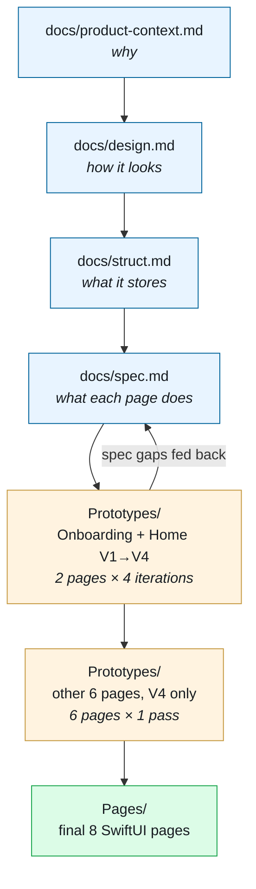

# AussieBridge

A platform for newly-arrived migrants in Sydney, combining **community Q&A** (categorized, credibility-tagged) with **1-on-1 volunteer matching**. The personal variation explored in this repo is **Context-First** — the app treats user identity, location, and urgency as a *filter* rather than a *feature*, so the same content surfaces differently depending on who is reading.

## Status

iOS prototype, built as a SwiftUI design system + 8 self-contained Pages. All 8 Pages are spec-driven and live behind `#Preview` in Xcode Canvas (open `ABDesignSystem/Package.swift`). Next milestone is an installable iOS app target.

## Repository layout

Top-level:

| Path              | What's inside                                                              |
| ----------------- | -------------------------------------------------------------------------- |
| `ABDesignSystem/` | Swift Package — the iOS prototype itself (tokens · components · models · pages) |
| `docs/`           | Written specs + Stitch HTML mockups (the project's readable spec set)      |

`ABDesignSystem/Sources/` (4-layer architecture):

```
Sources/
├── ABColors.swift · ABTypography.swift · ABSpacing.swift · ABElevation.swift   ← layer 1: design tokens
├── Components/                                                                  ← layer 2: 30 reusable SwiftUI components
├── Models/                                                                      ← layer 3: ABModels + ABMockData
├── Pages/                                                                       ← layer 4: 8 self-contained pages
│   ├── OnboardingView      — identity capture (language / status / location / arrival)
│   ├── HomeView            — search + service grid + featured guide + recommendations
│   ├── CommunityView       — discussions vs. people-to-help
│   ├── QAListView          — Reddit-style Q&A list with category filter
│   ├── QADetailView        — single thread + Top Answer + match-volunteer CTA
│   ├── VolunteerMatchView  — best-fit hero + "why she's a match" + more matches
│   ├── MessageListView     — All / Unread segmented inbox
│   └── ChatView            — shared-context handoff + action pills + bubbles
└── Screens/                                                                     ← layout scaffold helpers
```

`docs/`:

```
docs/
├── product-context.md  Context-First mechanism summary (5 contextual moments)
├── design.md           Authoritative design spec (tokens · type · elevation · components)
├── struct.md           Data model — 22 entities organised into 5 Context-First layers
├── struct.html         Rendered HTML version of struct.md (open in browser)
├── spec.md             Page-level functional spec — 4-block template per page (§1–§8)
└── mockups/            Stitch-generated HTML mockups — visual prior to the SwiftUI implementation
    ├── personalization.html · homepage.html · community.html · volunteer.html
    ├── qa.html · qa_scroll.html      (two variants — SwiftUI's QAListView consolidates both)
    ├── message.html · chat.html
```

## Quick start

1. Open `ABDesignSystem/Package.swift` in Xcode.
2. In the project navigator, click any file under `Sources/Pages/`.
3. Press `⌥⌘↵` to reveal the Canvas; choose **iPhone 15 Pro** (or **iPhone Dynamic Island**) as the preview target.
4. Click the live-preview ▶ button on the Canvas toolbar — interactions (scroll, tap, type) work in this mode.

To verify the package builds:
```sh
cd ABDesignSystem
swift build
```

## Design rationale

The product is built on one user-research insight, captured verbatim during a Checkpoint 1 interview:

> *"Language is a meta-barrier."*

This sentence drives every downstream decision: typography line-height, tag credibility hierarchy, visible match-reasons, context-aware chat handoff. Each of the 5 Context-First mechanisms exists because language gates information access — and gating must therefore be made visible, not algorithmic.

See `docs/product-context.md` for the full mechanism summary.

## AI workflow

This repo is built with a **spec-driven** workflow. The four `docs/*.md` files are the source of truth, and AI (Claude Code) is bounded to *executing each layer against the layer above it* — no free-form generation.

The four spec layers, top-down:

| Layer | Artefact | What it answers |
| ----- | -------- | ----------------- |
| 1. Why | `docs/product-context.md` | What product mechanism is being built and *why it exists* (5 Context-First moments). |
| 2. How it looks | `docs/design.md` | Tokens, typography scale, elevation, component visual grammar. |
| 3. What it stores | `docs/struct.md` | 22 entities + relationships across 5 Context-First layers. Mirrored in `ABModels.swift`. |
| 4. What each page does | `docs/spec.md` | Per-page 4-block template (Overview / Parameters / Actions / Layout). Wireframe-precision. |

### How the SwiftUI implementation got there

The implementation didn't go straight from spec to `Pages/`. It went through `Sources/Prototypes/`, which is where each page is **re-implemented from `spec.md` without reading the existing `Pages/` source**. The exercise validates whether the spec is sufficient to drive an implementation on its own — every place where the prototype had to self-pick a token, a copy string, or a behaviour is logged as a SPEC GAP at the top of the file.

The actual sequence:

1. **Two pages first** — Onboarding (`§1`) and Home (`§2`) were re-implemented from `spec.md` as the first experiment.
2. **Four iterations on those two** — V1 → V2 → V3 → V4. Each generation surfaced new gaps in the spec or the component library; each closure produced concrete repo changes (new components like `ABBackBar` / `ABPageHero` / `ABSectionTitle`, vocabulary additions in `spec.md §0.4`, copy-authority rule in `§0.5b`).
3. **The other 6 pages, re-rendered once** — by the time V4 stabilised on Onboarding + Home, the workflow was mature enough to re-derive Community / QA List / QA Detail / Volunteer Match / Message List / Chat in a single pass. Each first version is V4.
4. **Graduation to `Pages/`** — V4 prototypes that match their mockup and have no unresolved gaps become the shipped `Pages/*View.swift`.



`Sources/Prototypes/` stays in the repo as the evolution record — see `Sources/Prototypes/README.md` for what's in there and how to read it.

## Where the rest of the project lives

This repository is intentionally **product-only**. User research, ideation history, and presentation materials live alongside in `~/Desktop/xinyihan/uts-coursework/ios_innovation_studio/` — they're the path that led here, but they don't belong to the product itself.

## License

Personal academic project; no public license issued. Contact for re-use.
