# Linkaroo — Screens

> Visual catalogue of the 9 spec-driven core pages in the iOS prototype, in their `§1 → §9` order from `docs/spec.md`. Pages with a meaningful second state (a later step, a mid-scroll view) carry an inline pair so the rhythm of the page is visible at a glance.

  

---

## §1 · Onboarding
Personalisation engine's initialisation. Captures preferred language, current status, location, and time-in-Australia in one short, warm form. The result is the `ABUser` that every downstream surface reads from.

<table>
  <tr>
    <td valign="top" width="50%">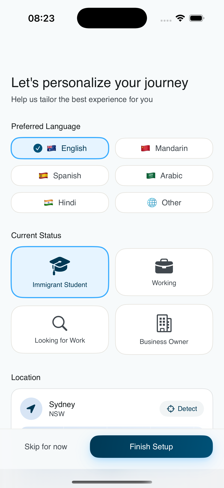</td>
    <td valign="top" width="50%">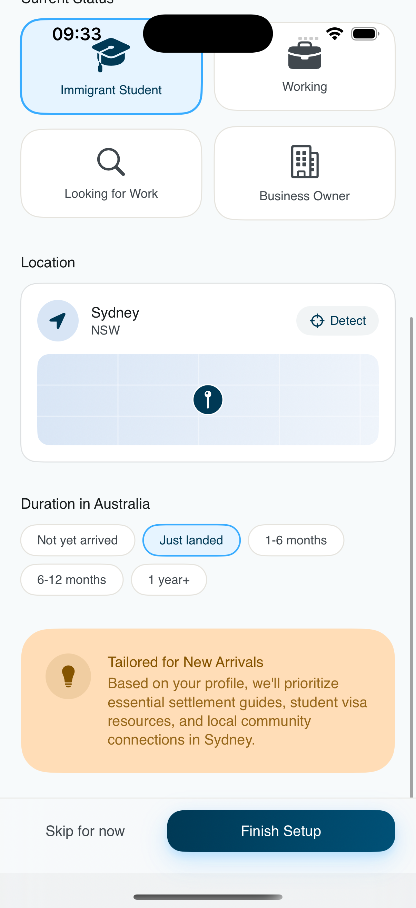</td>
  </tr>
</table>

## §2 · Home
Profile-driven push layer. Greeting + search entry + 10 essential service categories as a 2×5 grid + one Featured Guide + a recommendation list filtered by status × duration × language.

<table>
  <tr>
    <td valign="top" width="50%">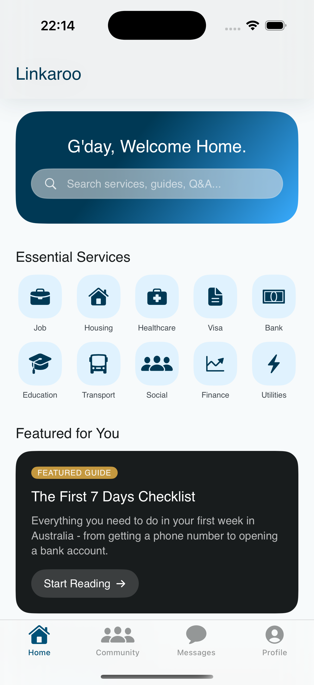</td>
    <td valign="top" width="50%">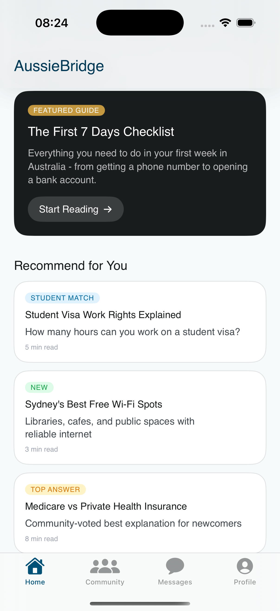</td>
  </tr>
</table>

## §3 · Community
Social spine. A single-page hub: "people you can help" (horizontal carousel of `ABHelpRequest`) above "questions you can answer" (vertical list of `ABQAPost`). No internal segmented control — Messages was promoted to its own tab.

<table>
  <tr>
    <td valign="top" width="50%">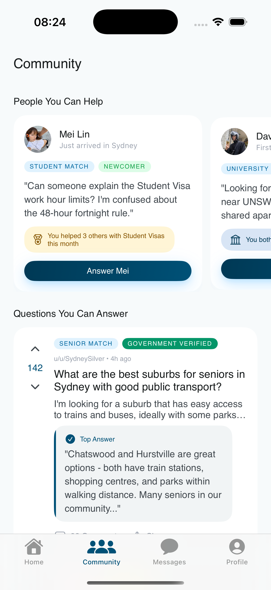</td>
    <td valign="top" width="50%">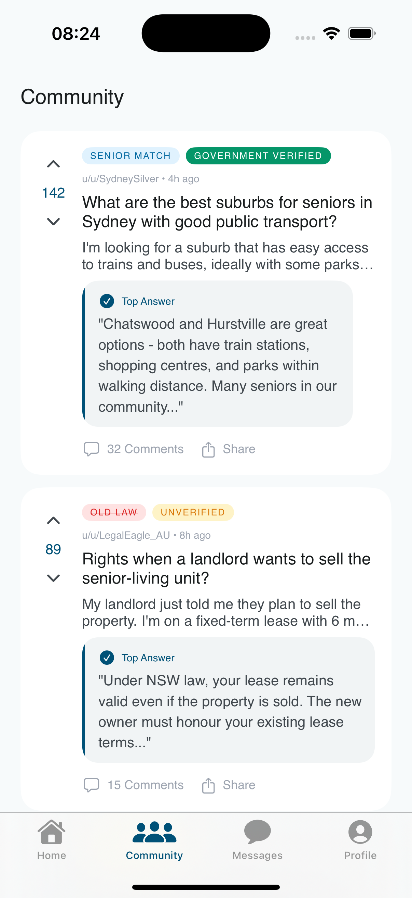</td>
  </tr>
</table>

## §4 · Q&A List
Deep filter view. Single category axis (All / Renting / Subletting / Utilities / Visa) on top of a Reddit-style list. Each row carries the `ABContentTag` set inline (authority / reliability / timeliness / urgency) so credibility is readable before the title.

<table>
  <tr>
    <td valign="top" width="50%">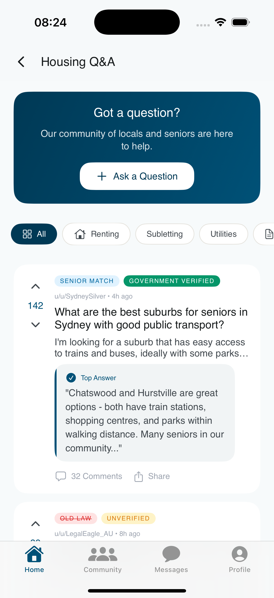</td>
    <td valign="top" width="50%">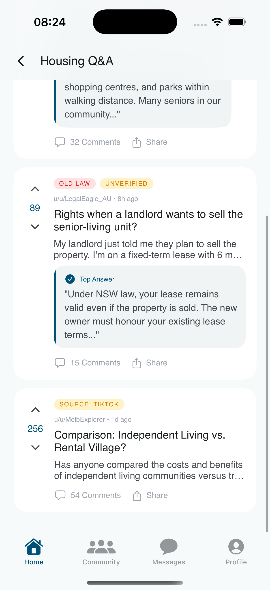</td>
  </tr>
</table>

## §5 · Q&A Detail
Product inflection point. A single thread with credibility tags pre-parsed and the Top Answer surfaced as a quote block. The "Match a volunteer" CTA forks the user into §6 — the load-bearing escalation that turns reading into a real 1-on-1.

<table>
  <tr>
    <td valign="top" width="50%">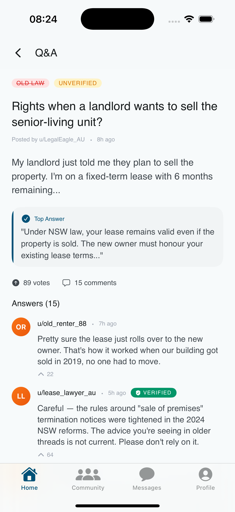</td>
    <td valign="top" width="50%">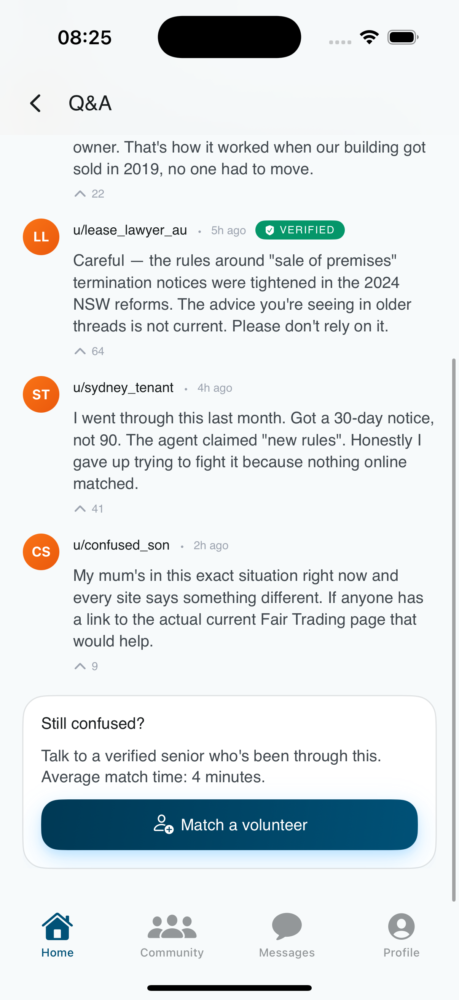</td>
  </tr>
</table>

## §6 · Volunteer Match
Where the matching algorithm becomes *legible*. Each volunteer is paired with explicit fit reasons ("UNSW alumna · NSW Renting Specialist · speaks Mandarin"). One Top Choice as a hero card with checkmark-bulleted reasons, then additional matches below.

<table>
  <tr>
    <td valign="top" width="50%">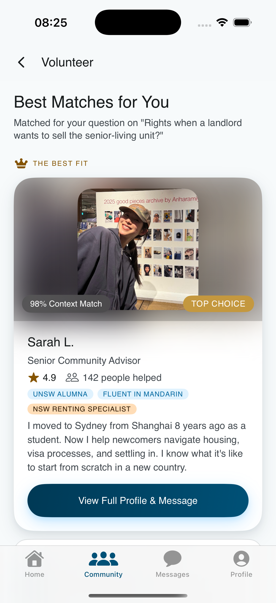</td>
    <td valign="top" width="50%">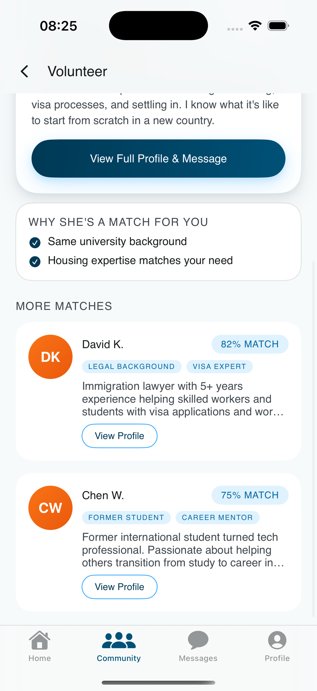</td>
  </tr>
</table>

## §7–§8 · Messages
Inbox-shaped re-entry surface paired with the conversation it opens into. The list (left) is an `All / Unread` segment with a numeric badge on Unread; each row carries online-state on the avatar. The chat (right) makes two design moves that separate it from a generic messenger: (a) originating `ABQAPost` mounted at the top as a shared-context card, persistent across re-entries; (b) action pill row between the context card and the input area for one-tap profile-tag sync. Tapping a row returns to the same chat with `ABSharedContext` still mounted.

<table>
  <tr>
    <td valign="top" width="50%">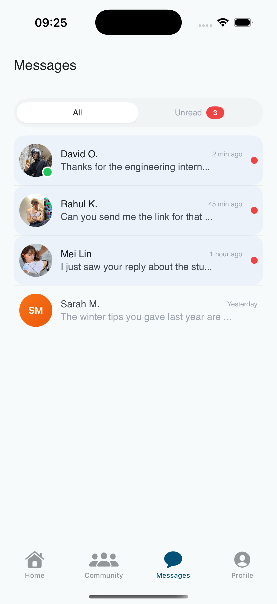</td>
    <td valign="top" width="50%">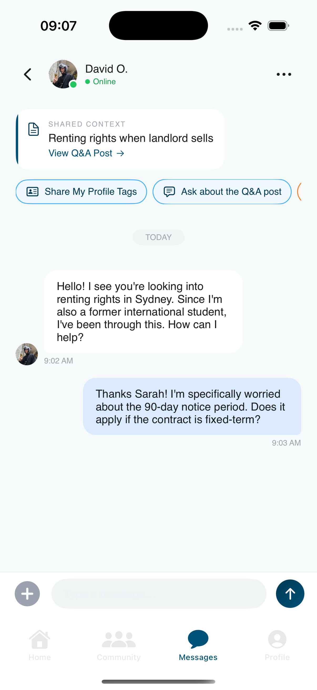</td>
  </tr>
</table>

## §9 · Profile
Read-back end of Mechanism 1. After §1 writes an `ABUser` into AppState, downstream surfaces consume it silently — Profile is the one place where the captured identity becomes visible. "Edit profile" re-enters §1 with values prefilled (single-source identity capture).

  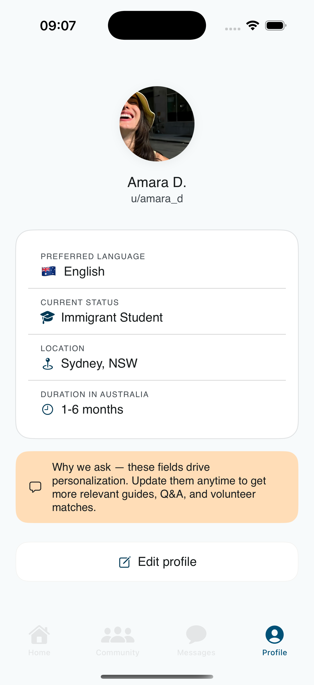

---

## Image inventory

All images live under `screenshots/` with slot-locked filenames so the python-docx pipeline (`uts-coursework/.../checkpoint3/submission/build_docx.py`) can map them by name without manual indexing. **Drop a PNG/JPG into the path; do not rename.**

| Slot | Filename | Status |
|------|----------|--------|
| Banner (Overview row) | `screenshots/00-banner.jpg` | placeholder |
| §1 Onboarding | `screenshots/01-onboarding.png` | filled |
| §1b Onboarding step 2 | `screenshots/01b-onboarding-step2.png` | filled |
| §2 Home | `screenshots/02-home.png` | filled |
| §2b Home scrolled | `screenshots/02b-home-scrolled.png` | filled |
| §3 Community | `screenshots/03-community.png` | filled |
| §3b Community scrolled | `screenshots/03b-community-scrolled.png` | filled |
| §4 Q&A List | `screenshots/04-qa-list.png` | filled |
| §4b Q&A List scrolled | `screenshots/04b-qa-list-scrolled.png` | filled |
| §5 Q&A Detail | `screenshots/05-qa-detail.png` | filled |
| §5b Q&A Detail scrolled | `screenshots/05b-qa-detail-scrolled.png` | filled |
| §6 Volunteer Match | `screenshots/06-volunteer-match.png` | filled |
| §6b Volunteer Match scrolled | `screenshots/06b-volunteer-match-scrolled.png` | filled |
| §7 Message List | `screenshots/07-message-list.png` | filled |
| §8 Chat | `screenshots/08-chat.png` | filled |
| §9 Profile | `screenshots/09-profile.png` | filled |
